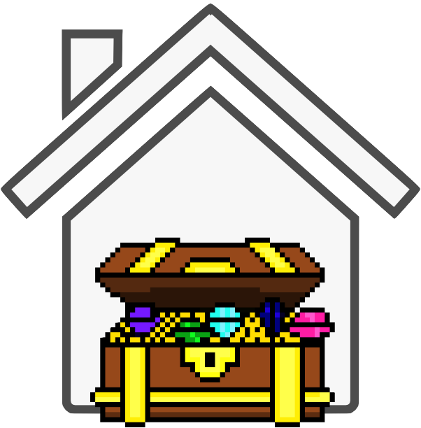

#  Lexxeous's Python House Treasure: 

### Summary
This program is a simple game that is compatible with `Python3`. The game supports play for 1 player. Text files *(`house0.txt` through `houseN.txt`)* are provided in the `/maps` directory as different layouts for the game *(where `N` is the last house number)*. The goal is to traverse the house, find keys, unlock doors, and collect all the treasure.    

By default, when the program is run, the player is placed in the game after a house is chosen at random. The user can, however, choose which house they want to play specifically, without relying on the RNG of the map picker. The player must collect all of the treasure in the house to win.

### Instructions
The `Makefile` contains two commands that are useful for default play. By running `make run`, the game will automatically import the data from the `maps_info.csv` file, choose a random house to play, assign the correct parameters from the imported map info, and continue the game for 1 player. By running `make runH`, the game will automatically choose `house0.txt`, but the user can specify which map they want to play by appending `map=houseX.txt` to the terminal command *(where `X` is the number of the house the user wants to play)*. The `maps_info.csv` file can be manually updated by adding valid parameters as set by the column names/values.

### Disclaimers
If an update is made to the `maps_info.csv` file, it will be reflected in the way the game/maps operate. There is a dependency relation between the location of spawn points and keys. The game may be unbeatable if the player spawns in an inproper location.   

If house data is added to the `maps_info.csv` file, the associated text file must also be created for the game to use as a map. Houses are built with `*` *(representing the walls)* and `<space>` *(representing the open areas)* characters **ONLY**. There is a maximum of 5 keys *(labeled 0, 1, 2, 3, & 4)* and 5 doors *(labeled 5, 6, 7, 8, & 9)*. Each door is opened by the key that is 5 less than its own value *(eg. key 0 opens door 5 and key 3 opens door 8)*. Treasures must be labeled with a lowercase `t`.   

Hypothetically, there is no limit on the amount of treasures the house can contain or the size of the house itself.

### Features
When playing, players are able to move around the map by using the standard `WASD` format and pressing enter. The current inventory of keys and the current number of treasure collected *(out of the total for the map)* is displayed during every move, for the player's convenience.